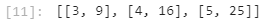

```{r setup, include=FALSE}
knitr::opts_chunk$set(echo = TRUE)
```

For the Summer 2021 semester I'm taking two courses: DS 5001 Exploratory Text Analytics and DS 5110 Big Data. To catalog my learning I'll be compiling weekly notes from lecture, additional resources, and code that will be stored in this document. This document will focus on the Big Data information. This [document](DS_5001_Text_Analytics.html) will focus on the Text Analytics information. 

**Resources**

* [Apache Spark Documentation](http://spark.apache.org/documentation.html)
* [Learning Spark 2nd Ed.](https://learning.oreilly.com/library/view/learning-spark-2nd/9781492050032/titlepage01.html)
* [Learning PySpark](https://learning.oreilly.com/library/view/learning-pyspark/9781786463708/)

# Week 1 - Apache Spark and MapReduce Framework 

## MapReduce 

MapReduce is a key operation in the Hadoop ecosystem. By using MapReduce applications can process large amounts of data in-parallel on large clusters. [Source](https://hadoop.apache.org/docs/r1.2.1/mapred_tutorial.html#:~:text=Hadoop%20MapReduce%20is%20a%20software,reliable%2C%20fault%2Dtolerant%20manner.)

The MapReduce paradigm consists of map tasks and reduce tasks. MapReduce takes a dataset and assigns each record a key (by mapping) and then tallies each occurrence of the key across clusters. The end result is a collection of <key, value> pairs.  

A common use of MapReduce is performing a word count on a text.  

The [history Hadoop's creation](https://www.geeksforgeeks.org/hadoop-history-or-evolution/) is interesting and involves two white papers from Google. Google's File System (GFS) and the development of MapReduce were the two critical components needed to create Hadoop. Doug Cutting took the project to Yahoo! and was able to develop Hadoop as an open source project. Hadoop is now maintained by the Apache Software Foundation.  


An example of how MapReduce processes an example is shown above. 

**Input:** 

* A string of words is input into the application.

**Splitting:** 

* The input of a string of words is first split into different clusters for processing. A certain number of records is assigned to each cluster (worker). 
* The more splits (clusters) created the faster the processing time. However, each split incurs an overhead cost. So, depending on the size of the data, it is possible to slow down processing by creating too many splits.    

**Mapping:** 

* The string of words in each cluster is then split into each single word (which acts at the key) and assigned a value of 1. 
* No aggregation is done at this step. If a word appears multiple times it will have multiple entries with a value of 1. 

**Shuffling:** 

* Each key is "grouped" together by the key and for each occurrence across the clusters a value of 1 is added to a list associated with the key.  
* This step in the process is most costly due to data being moved from one cluster to another. 
    * One way to work around this limitation is to run a combiner function on each cluster individually before starting the shuffling step. 
    * Depending on the operation that is being attempted this method may not work. For example, this cannot be done when trying to compute the average. 

**Reducing:** 

* The list of values associated with each key is reduced to a single value by adding all the values in the list associated with the key. This tallies the number of key occurrences. 

**Final Result:** 

* At the end of this operation, a list of keys and their values is produced. In this example, that is a list of all words present in the input and the number of times they occurred in the input.

## Spark

Spark employs MapReduce as well. However, the Mapper and Reduce functions are not detailed explicitly. 

Hadoop (HDFS) can be used with Spark. Spark reads in the data from Hadoop and writes the results back to it.   

Spark can run batch processing up to 10 times faster than MapReduce and 100 times faster for in-memory analytics. 

Results and intermediate steps can be cached to save on processing time later. 

Spark has APIs for Python, Java, Scala, R, SQL, can integrate with Hadoop and Cassandra, and can access HDFS, S3, etc.  

Some Spark Terminology:

* Cluster: a set of connected computers (nodes)

* SparkSession - single point of entry to interact w Spark functionality

* Resilient Distributed Datasets (RDDs) - Spark’s fundamental abstraction for distributed data and computation

* Driver Program - contains application main function, defines RDDs on cluster, applies operations to them.

* Worker Node or Executor - the units that perform tasks

## Code Example 

Create a spark session 

``` 
# import libraries
from pyspark.sql import SparkSession
import os

# context manager
spark = SparkSession.builder.getOrCreate()

sc = spark.sparkContext
``` 

```
spark
```


For this example, a text file is needed in the working directory to read in. 
```
# list files in the directory
os.listdir()
```
```
# Read in data
lines = sc.textFile("README.txt")
```
When the Spark Session reads in the data a Resilient Distributed Dataset (RDD) is created. More information on RDDs is found in the Week 2 section. An RDD is the data structure Spark creates when distributing data across clusters.   
```
type(lines)
```


The .count() function returns a count. .take() returns a number of records. You specify the number of records to return by entering a value inside the (). 
```
# count the number of lines in the .txt file
lines.count()

# show some records
lines.take(5)
```


The following code splits the input text into words and returns the first 15. Then the words are reduced to word counts and the top ten most frequent are returned. 

```
# Show top 10 most frequent words

words = lines.flatMap(lambda x: x.split())
type(words)
words.take(15)
```


```
wordcounts = words.map(lambda x: (x, 1)) \
                  .reduceByKey(lambda x,y:x+y) \
                  .map(lambda x:(x[1],x[0])) \
                  .sortByKey(False)
wordcounts.take(10)
```


**Note on map() vs flatMap()**

When map() is used in a list comprehension such as:

```
sc.parallelize([3,4,5]).map(lambda x: [x,  x*x]).collect() 
```
A list of lists is produced. 



When flatMap() is used in the same context:
```
sc.parallelize([3,4,5]).flatMap(lambda x: [x, x*x]).collect() 
```
A list is produced. 


## Additional Sources

* DS 5110 00 MapReduce Framework Lecture Notes 


# Week 2 - Resilient Distributed Datasets and Running a Cluster 

## Resilient Distributed Datasets (RDDs)

RDDs are the most basic abstraction in Spark. They exhibit the following properties:

* **resilient**: list of dependencies instructs Spark how the RDD is constructed from inputs.  
    * In the event the RDD is compromised, Spark can recreate it from dependencies.
  
* uses `partitions` for storing pieces of the data. Spark automatically partitions RDDs and distributes the partitions across nodes in the cluster.
  
* **distributed**: placing the partitions across nodes in the cluster allows for storing massive datasets that wouldn't fit on a single machine. 

**RDD History**

Before Spark 2.0, the main programming interface of Spark was the *Resilient Distributed Dataset (RDD)*.  

Starting with Spark 2.0, the *Dataset* and *DataFrame* objects were released. 

### RDD Creation 

See code example from previous week. 

Spark handles the distribution of data across clusters (called parallelization of operations). Spark also creates a plan to optimize performance (more on that in the actions section). 

**RDD Operations** 

* RDD.persist() - store RDD
* RDD.cache() - same as persist but has a default storage level 
* RDD.collect() - retrieve RDD from driver 
* RDD.take() - return number of elements from RDD
* RDD.first() - return first element from RDD
* RDD.saveAsTextFile() 
* RDD.saveAsSequenceFile()

### RDD Transformation 

Transformations create new RDDs. 

**Transformation Functions**

* map() - apply a transform to each element in RDD
* flatMap() - apply map but return list of elements as a single list 
* filter()  
* parallelize() - distribute data to workers 
* reduceByKey() - Runs several parallel reduce operations, one for each key. Combining is done locally on each machine for each key before computing a global combine for the key. This reduces shuffling of the data across nodes, which is expensive.

Narrow transformation - can operate independently of each data partition (ex. filter)

Wide transformation - requires shuffling of data between clusters (ex. median, average)

### RDD Action 

Spark is lazy meaning it doesn't perform work until an action is called. This also allows Spark to optimize the transformation operations before they're performed. 

Spark actions return a list data type instead of RDD. 

**Action Functions** 

* reduce() - Process elements into a new element of the same type. Often used with lambda functions 
* fold() - Similar to `reduce()`, includes “zero value” acting as identity  
* aggregate() - Similar to `reduce()` and `fold()` uses: initial value, combining function for each worker or node, combining function to merge results across workers.
* countByValue() - Return the count of each unique value in this RDD as a dictionary of (value, count) pairs.

Pair RDD Actions 

* countByKey() - get count for each key
* collectAsMap()  - Return the key-value pairs in this RDD to the master as a dictionary.
* lookup() - Return a list of values for specified key 

## RDDs vs Pair RDDs

Pair RDDs is a collection of <key, value> pairs (Python dictionary). They are useful for merging and aggregating data. 

Applying the map function to an RDD creates a pair RDD. 

## Running Spark on a Cluster 

Placeholder 

## Code Examples 

Once data is parallelized, keys can be extracted with the following command:  
```
# Extract the keys
rdd.keys().collect()
```
Duplicates are not removed. 

Producing Wordcount Example:
```
# Read in data
lines = sc.textFile("README.txt")

wordcounts = lines.map(lambda x: x.replace(',',' ') \
                        .replace('.','   ').replace('-',' ').lower()) \
                        .flatMap(lambda x: x.split()) \
                        .map(lambda x: (x, 1)) \
                        .reduceByKey(lambda x,y:x+y) \
                        .map(lambda x:(x[1],x[0])) \
                        .sortByKey(False) 
                        
wordcounts.take(10)
```


# Week 3 - Spark Dataframes and Spark SQL 

## Spark Dataframes 

* A Dataset is a distributed collection of data   
* A Dataset can be constructed from Java Virtual Machine (JVM) objects and then manipulated using functional transformations (`map()`, `flatMap()`, `filter()`, etc.)  
* A DataFrame is a Dataset organized into named columns  
* DataFrames can be constructed from a wide array of sources such as: structured data files, tables in Hive, external databases, or existing RDDs.  
* The DataFrame API is available in Scala, Java, Python, and R.

Functions 

* withColumn() - add new column (similar to Tidyverse mutate())
* read.csv() - read data into df 
* createDataFrame - pass data to function to create df
* toDF() - convert a RDD to a df 
* df.rdd() - create RDD from df 
* show() - print result of function calls 

### When to Use DF vs RDD

* Most work can be done with DataFrames  
* Use DataFrames to use high-level expressions, to perform SQL queries to explore the data, and to gain columnar access.  
    * For example, if you are thinking about the data by field names, you probably want the data in a DataFrame.
* For machine learning and building predictive models, DataFrames are recommended. 
    * You will be exploring the data by column, and building features from the columns of data.  
* RDDs can be useful to perform low-level transformations and actions on unstructured data. 
    * For example, filtering strings and performing other simple transformations on text is best done with RDDs.  In these cases, the analyst doesn't care about field names, and there is no need to impose schema on the data.  
* Use RDDs when you want to manipulate the data with functional programming constructs rather than domain specific expressions.

### Example Code 

Create DataFrame by passing data and schema to createDataFrame()

``` 
# import context manager: SparkSession
from pyspark.sql import SparkSession

# import data types
from pyspark.sql.types import StructType, StructField, StringType, IntegerType

# set up the session
spark = SparkSession.builder.getOrCreate()

# create some data; list of tuples
data = [
    (0, "Hi I heard about Spark"),
    (1, "I wish Java could use case classes"),
    (2, "Logistic regression models are neat")
]

# define schema; each field holds (name, data type, nullable)
# for large number of fields, best to automate schema construction
schema = StructType([StructField('id', IntegerType(), False), 
                     StructField('sentence', StringType(), False)])

# create df by passing data, schema
sentenceDataFrame = spark.createDataFrame(data, schema)

# print first few records
sentenceDataFrame.show()

# print data type
print(type(sentenceDataFrame))
```


Create df from RDD 
```
# import modules 
from pyspark.sql import Row

# Map the RDD to a DF

df = rdd.map(lambda line: Row(longitude=line[0], 
                              latitude=line[1], 
                              housingMedianAge=line[2],
                              totalRooms=line[3],
                              totalBedRooms=line[4],
                              population=line[5], 
                              households=line[6],
                              medianIncome=line[7],
                              medianHouseValue=line[8])).toDF()
```

Filter DF 

Can also use where() in place of filter

* col() - extract col from df 
* asc() - sort asc or desc 
```
from pyspark.sql.functions import col, asc

df.filter((col("name") == "Andy") | (col("name") == "Michael")).sort(asc("name")).show()

# alternatively using df.name instead of col("name")
df.filter((df.name == "Andy") | (df.name == "Michael")).sort(asc("name")).show()
```
Filter Nulls 

```
#return null results
df.filter(col("age").isNull()).show() 

#return not null results 
df.filter(col("age").isNotNull()).show() 
```
Impute Missing Values 
```
df.fillna(0).show()
```

Summarize a Column 
```
df.describe("age").show()
```

## Spark SQL 

When working with Spark SQL you can specify a schema for the data you are working with. Three items are specified for each field: column name, data type, T/F whether nulls are allowed. 

Ex. Schema:
```
schema = StructType([StructField("author", StringType(), False), StructField("pages", IntegerType(), False)])
```

Spark is able to infer schema. However, to do so Spark must read in a representative amount of data to infer the schema which has a performance cost. Additionally, Spark doesn't alway infer correctly. 

Spark Data Types:

* integer types, all `int` in python:
  * ShortType
  * IntegerType
  * LongType
  * FloatType
  * DoubleType
* StringType
* BooleanType

Data can be loaded from different structured formats (JSON, Hive, Parquet, etc.). 

Data can be queried within Spark with SQL or other external tools. 

Spark SQL integrates between SQL and Python / Java / Scala / R. Able to join RDDs and tables. 

### Example Code 

A temp view has to be created before SQL queries can be created and run. 
```
# register DataFrame as temp view with name "people"
df.createOrReplaceTempView("people")

# query the view
sqlDF = spark.sql("SELECT * FROM people where name == 'Andy'")
sqlDF.show()
```
Regular SQL queries can be passed to .sql(). 

Aggregate operations require import from `pyspark.sql.functions`
```
from pyspark.sql import functions as F

agg_df = df.groupBy("location").agg(F.min("id"), F.count("id"), F.avg("date_diff"))
```
## Parquet Files 

* Project was developed at Twitter, taken over by Apache Software Foundation (Apache)   
* Parquet is a columnar format that is supported by many other data processing systems  
* Spark SQL provides support for both reading and writing Parquet files that automatically preserves the schema of the original data. When writing Parquet files, all columns are automatically converted to be nullable for compatibility reasons.

### Example Code

Write DF to Parquet file, partitioning columns
```
df = df.withColumn('end_month', F.month('end_date'))
df = df.withColumn('end_year', F.year('end_date'))
df.write.partitionBy("end_year", "end_month").parquet("/tmp/sample_table")
```
Infer the schema when reading in file
```
adult_df = spark.read.\
    format("com.spark.csv").\
    option("header", "false").\
    option("inferSchema", "true").load("dbfs:/databricks-datasets/adult/adult.data")
adult_df.printSchema()
```

Saving and Loading Data

Save / Load using Generic Functions

```
df = spark.read.load("examples/src/main/resources/users.parquet")
df.select("name", "favorite_color").write.save("namesAndFavColors.parquet")
```
Save / Load using Manually Specified Formats
```
df = spark.read.load("examples/src/main/resources/people.json", format="json")
df.select("name", "age").write.save("namesAndAges.parquet", format="parquet")
```

## Additional Links

* https://www.datacamp.com/community/tutorials/apache-spark-tutorial-machine-learning
* https://docs.databricks.com/spark/latest/dataframes-datasets/introduction-to-dataframes-python.html

